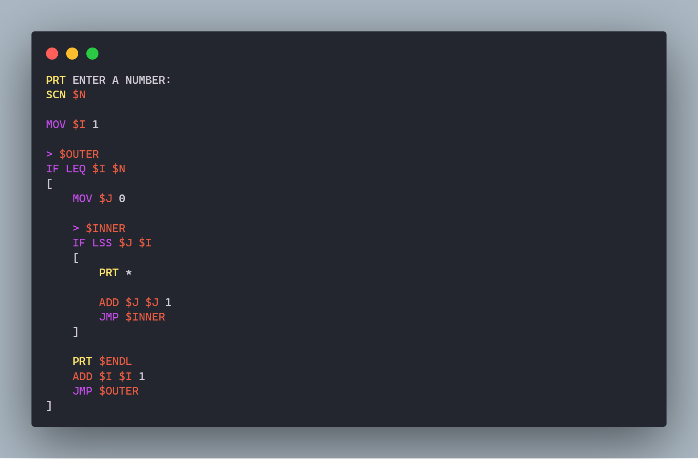
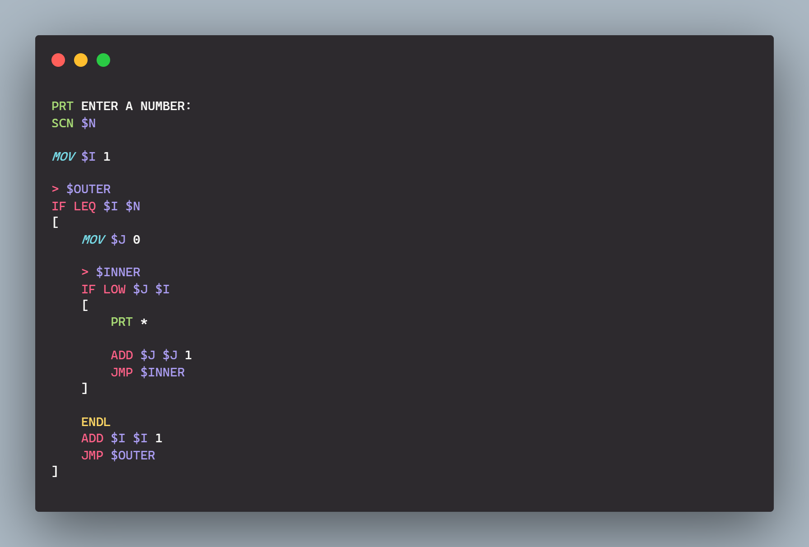

<h1 align="center">
  <br>
    
  <br><br>
  Fun Assembly Programming Language
  <br>
  <br>
</h1>

## About

It's a simple token-based modular programming language written in C++. <br>
Authors- [Soham Malakar](https://www.linkedin.com/in/soham-malakar-108533207) and [Sanket Tarafder](https://www.linkedin.com/in/sanket-tarafder-bbb33117b).

---

## Know About The Authors

[**Soham Malakar**](https://www.linkedin.com/in/soham-malakar-108533207) is a student pursuing Bachelor of Science (Hons.) in the Computer Science Department of Scottish Church College, Kolkata. He is very passionate about computers and innovation.

[**Sanket Tarafder**](https://www.linkedin.com/in/sanket-tarafder-bbb33117b) is a student pursuing Bachelor of Technology in the Information Technology Department of Kalyani Government Engineering College, Nadia. He is a computer and data enthusiast.

---

## Overview

It is a Procedure Oriented Programming Language that uses a simple expression evaluator. It stores the variables and elements in a hash table. As the interpreter for this language is rather basic, it does not come with any loops and functions. But these functionalities are easy to obtain using jumps.

The language has a built-in Module System to create modules. It is pretty similar to functions in most programming languages.

---

## Disadvantages

- There is no scope system. Variables are global.
- It doesn't support structures and file handling.

---

## Installation

There are few pre-compiled binaries available in the [release](https://github.com/SohamMalakar/Fun-Assembly/releases/latest) section. Download the archive from there and extract the files. Then, run the installation script.

---

## Build from Source

If you don't find any suitable version for your system, please follow the instructions below.

### Windows

1. Download the files from [here](https://github.com/SohamMalakar/Fun-Assembly/archive/refs/heads/master.zip).

2. Extract the files. (**_NOTE:_** You can extract the files using [7-Zip](https://www.7-zip.org/) or any other program)

3. Run the `install.bat` script.

> **_NOTE:_** Make sure you have the latest [g++](https://winlibs.com/) compiler installed in your system.

### GNU/Linux

Run the following commands in a terminal.

```
$ git clone https://github.com/SohamMalakar/Fun-Assembly.git
$ cd Fun-Assembly
$ make install
```

That's it!

> **_NOTE:_** Make sure you have git, make and g++ installed in your system.

---

## Usage

After installing the Fun Assembly Compiler, you can run the following command to run \*.fasml files.

```
$ fasml <filename> [optional arguments]
```

> **_NOTE:_** Alternatively, you can use [Joi Akash](https://marketplace.visualstudio.com/items?itemName=SohamMalakar.joiakash) Extension for [Visual Studio Code](https://code.visualstudio.com/) to run \*.fasml files.

---

## Extension

We have also provided the syntax highlighter for this programming language for Visual Studio Code.

| Andromeda                                  | Monokai-Pro                                |
| ------------------------------------------ | ------------------------------------------ |
|  |  |

You can install the extension from [Marketplace](https://marketplace.visualstudio.com/items?itemName=skt09.fun-assembly-syntax).

---

## Keywords

There are total 25 reserved Keywords and 8 Logical Operators present in this language which get recognized by this compiler.

The 25 Keywords with their functions are provided here:

| Keywords | Description                                       |
| -------- | ------------------------------------------------- |
| `PRT`    | Prints the tokens                                 |
| `SCN`    | Takes inputs from the keyboard                    |
| `SCNL`   | Takes inputs upto the next newline character      |
| `MOV`    | Assigns a value to a variable                     |
| `INT`    | Converts a variable to an integer                 |
| `ADD`    | Adds two variables                                |
| `SUB`    | Subtracts two variables                           |
| `MUL`    | Multiplies two variables                          |
| `DIV`    | Divides two variables                             |
| `MOD`    | Modulo of two variables                           |
| `POW`    | Raises a variable to the given power              |
| `EXPR`   | Evaluates an expression                           |
| `IF`     | If the condition is true, executes the block      |
| `>`      | Creates a label                                   |
| `JMP`    | Jumps to a label                                  |
| `ARR`    | Assigns a value to an array                       |
| `ARRI`   | Initializes an array                              |
| `ARRV`   | Assigns the element's value into another variable |
| `BYE`    | Exits the program                                 |
| `!`      | Comments out any text                             |
| `STR`    | Stores strings as character arrays                |
| `CAT`    | Concatenates strings                              |
| `CALL`   | Calls a module                                    |
| `RECV`   | Receives values from a module                     |
| `RET`    | Returns from a module                             |

The 8 Logical Operators with their meanings are provided here:

| Logical Operators | Description                                                         |
| ----------------- | ------------------------------------------------------------------- |
| `EQL`             | Checks if the two variables are equal                               |
| `NEQ`             | Checks if the two variables are not equal                           |
| `LSS`             | Checks if the first variable is less than the second                |
| `LEQ`             | Checks if the first variable is less than or equal to the second    |
| `GTR`             | Checks if the first variable is greater than the second             |
| `GEQ`             | Checks if the first variable is greater than or equal to the second |
| `SEQL`            | Checks if the two strings are equal                                 |
| `SNEQ`            | Checks if the two strings are not equal                             |

---

## Syntax

The syntax is very simplistic and easy to understand.

### Hello World

Here is the Hello World program:

```
PRT Hello World
```

Here, the compiler prints the tokens 'Hello' and 'World'.
Tokens are separated by spaces. The compiler will ignore the spaces.
But it'll print the spaces in between the tokens.

---

### Assignment Operator

To store a variable, we use the keyword `MOV`.

```
MOV $var1 Hello
```

Here, we assign the value 'Hello' to the variable `$var1`.
There are no data types in this language. So, you can assign any type of data to a variable.

---

### Printing Variables

Now, to print the variable, we use the keyword `PRT`.

```
PRT $var1
```

And yes. You can print multiple variables at once.

---

### Printing Special Characters

Now, to print a new line, tab, space, exclamation mark, dollar sign, and ampersand, we print these predefined variables: `$ENDL`, `$TAB`, `$SPC`, `$EXL`, `$DOL`, `$AMP` respectively.

```
PRT Hello World
PRT $EXL
PRT $ENDL
```

It prints 'Hello World!\n'.

> **_NOTE:_** Other special characters can be printed by using `PRT` with the character itself. For example, `PRT %` prints a percent sign.

---

### Taking Inputs

Now, to take input from the keyboard, we use the keyword `SCN`.

```
SCN $var1
```

Here, the compiler takes input from the keyboard and assign it to the variable `$var1`.
And multiple inputs can be taken at once.

Now, to take input upto the next newline character, we use the keyword `SCNL`.

```
SCNL $var1
```

Here, the compiler takes input upto the next newline character from the keyboard and assign it to the variable `$var1`.

---

### Math Operations

To add, subtract, multiply, divide, modulo, and power two variables, we use the keywords `ADD`, `SUB`, `MUL`, `DIV`, `MOD`, and `POW` respectively.

```
ADD $var3 $var1 $var2
```

Here, the compiler adds the values of the variables `$var1` and `$var2` and assign the result to the variable `$var3`.

Now, just replace `ADD` with `SUB`, `MUL`, `DIV`, `MOD`, and `POW` to get the result of subtraction, multiplication, division, modulo, and power respectively.

But it'll convert the variables to floats before performing the operation.

---

### Expression Evaluation

To evaluate an expression, we use the keyword `EXPR`.

Consider the following code snippet:

```
MOV $var1 2
MOV $var2 3

EXPR $out ( $var1 + 5 ) * -10 / $var2

PRT $out $ENDL
```

Here, the compiler evaluates the expression `( $var1 + 5 ) * -10 / $var2` and assign the result to the variable `$out`.

---

### Integer Casting

To convert a variable to integer, we use the keyword `INT`.

```
INT $var1 $var2
```

Here, the compiler converts the variable `$var2` to integer and assign it to the variable `$var1`.

---

### Labels

Instead of separate `loop structures` or `if-else structures` we incorporate only `IF` with `JMP` to perform even the complex tasks. To work with `JMP` easily, we have introduced `labels` in this language.

The `label` is a special type of variable which will hold it's own line number into the given label.

```
> $START
```

It will create a `label` named `$START` which will contain the line number where it is introduced.

---

### If Statements

To implement if-else statements, we use the keywords `IF` and `JMP`.

```
IF EQL $var1 $var2
[
    PRT SUCCESS
    JMP $END
]
IF NEQ $var1 $var2
[
    PRT FAILURE
    JMP $END
]

> $END
```

Here, the compiler checks if the values of the variables `$var1` and `$var2` are equal.
If they are equal, the compiler prints 'SUCCESS' and jump to the label `$END`.
If they are not equal (else), the compiler prints 'FAILURE' and jump to the label `$END`.

There is no ELSE keyword. So, this is the only way to implement if-else statements.

To get the desired condition, replace the `EQL` with the other logical operators.

---

### Loops

To implement loops, we use the keyword `JMP` with `labels`.

```
> $LOOP
IF EQL $var1 $var2
[
    JMP $LOOP
]
```

Here, the compiler checks if the values of the variables `$var1` and `$var2` are equal.
If they are equal, the compiler jumps back to the label `$LOOP`.
If they are not equal, the compiler exits the loop.

---

### Arrays

To store an array, we use the keyword `ARR`.

```
ARR $array $index $value
```

Here, the compiler assigns the value `$value` to the array `$array` at the index `$index`.

To initialize an array, we use the keyword `ARRI`.

```
ARRI $array 1 2 3 4 5
```

Here, the compiler initializes the array `$array` with the values `1`, `2`, `3`, `4`, and `5`.

To get the value of an array, we use the keyword `ARRV`.

```
ARRV $var1 $array $index
```

Here, the compiler assigns the value of the array `$array` at the index `$index` to the variable `$var1`.

Now, to print the value of the element at the index `$index`, we use the keyword `PRT`.

_Method 1:_

```
MOV $index 0
ARRV $var1 $array $index
PRT $var1
```

Here, the compiler assigns the value of the array `$array` at the index `$index` to the variable `$var1`.
Then the compiler prints the value of the variable `$var1`.

_Method 2:_

```
PRT $array(0)
```

Here, the compiler prints the value of the element at the index `$index` of the array `$array`.

> **_NOTE:_** However, you can't iterate an array using method 2.

---

### Strings

We can perform various string operations in this programming language. The language contains two keywords and two logical operators and a special `NULL` character to deal with strings.

`STR` keyword is used for storing the given string as a character array and add a `NULL` string at the end.

```
PRT Enter your name:
PRT $SPC
SCNL $name

STR $name
```

The above code snippet takes a string as input and stores it as a string in the memory.

---

### String Concatenation

To concatenate two or more strings together, we use the keyword `CAT`.

```
CAT $str3 $str1 $str2
```

Here, the `CAT` keyword concatenates the strings `$str1` and `$str2` and assign the result to the variable `$str3`.

---

### Comments

To comment a line, we use the exclamation mark `!`.

```
! This is a comment
```

It only supports single line comments.

---

### Bye

To terminate the program, we use the keyword `BYE`.

```
BYE 0
```

Here, the compiler terminates the program with the exit code 0.

---

### Command Line Arguments

To run the interpreter with command line arguments, do the following:

```
$ fasml samples/command_line_args.fasml C C++ Python Java
```

Here, we run the file `command_line_args.fasml` with the command line arguments `C`, `C++`, `Python`, and `Java`.

The `command_line_args.fasml` file contains the following code:

```
MOV $I 0

> $LOOP
IF LSS $I $ARGC
[
    INT $I $I
    PRT &I
    PRT $ENDL

    ADD $I $I 1

    JMP $LOOP
]
```

> **_NOTE:_** `$ARGC` is predefined. It contains the number of command line arguments.

Here, we assign the value of the variable `$I` to 0.

Then, we check if the value of the variable `$I` is less than the value of the variable `$ARGC`.
If it is true, we print the `$I`th argument from the command line.

Then, we increment the value of the variable `$I` by 1.

Finally, we jump back to the label `$LOOP`.

If we look closely,we find it's `PRT` followed by `&I`. It means that we grab the value of the variable `$I` and put a extra `$` before it. So, the interpreter will print the value of `$0`, `$1`, `$2`, and so on.

You can also print them in the following way:

```
PRT $0 $1 $2
```

> **_NOTE:_** Here, `$0` is the file name. And `$1`, `$2`, and so on are the command line arguments. These are predefined.

---

### Module System

#### Create Modules

To create modules, follow the following steps:

- Create a file with the extension `.fasml` in the same directory as the main file.

- Now, you have to define the module.

- After defining the module, you can return values from it by using the keyword `RET`.

  ```
  RET $var1 $var2
  ```

  Here, the compiler returns the values of the variables `$var1` and `$var2` to the caller.

> **_NOTE:_** A module is nothing but a typical fasml file with `RET` keyword(s).

#### Call Modules

To call the module, use the keyword `CALL`.

```
CALL module_name $arg1 $arg2
```

Here, the compiler calls the module `module_name` and passes the values of the arguments `$arg1` and `$arg2` to it.

> **_NOTE:_** The `module_name` should be the same as the module name without the extension.

#### Accessing Arguments

To access the arguments of the module use `$1`, `$2`, and so on.

```
MOV $var1 $1
```

Here, the compiler assigns the value of the 1st argument to the variable `$var1`.

> **_NOTE:_** `$0` is the relative path of the module and `$ARGC` is the number of arguments passed to the module.

#### Receiving Values from Modules

To receive the return values from the module, use the keyword `RECV` after calling the module.

```
RECV $var1 $var2
```

Here, the compiler assigns the values of the returned variables to `$var1` and `$var2`.

> **_NOTE:_** Before calling another module, you have to receive the return values from the previous module. Otherwise, the return values will be lost.

---

## Samples

There are some examples in the [samples](https://github.com/SohamMalakar/Fun-Assembly/tree/master/samples) folder. You can analyze them to get a better understanding.

> **_NOTE:_** Make sure these files are in LF format and not in CRLF format.

---

## Contribution

If you want to contribute to this language, feel free to open an [issue](https://github.com/SohamMalakar/Fun-Assembly/issues) or create a [pull request](https://github.com/SohamMalakar/Fun-Assembly/pulls).
